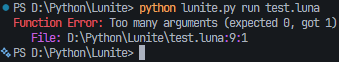

  

# The Lunite Programming Language
© Lunite by ANW (Subhrajit Sain), 2025-2026

**Version:** v1.8.4  
**Language update date:** 6th January, 2026  
**Documentation update date:** 6th January, 2026

> "Lunite is an interpreted and compiled (more like 'binded') hybrid language (OOP + POP) built with/on Python." - ANW, creator of Lunite.

---

## How to Build Lunite Executable  
1. Install PyInstaller using `pip3 install pyinstaller`
2. Copy `lunite.py` and `icon.png` to a separate folder (e.g., `tmp`) for easy building (e.g., `mkdir -pv tmp && cp -v lunite.py tmp && cp -v icon.png tmp`).
3. Navigate to the directory where you copied the files (e.g., `cd tmp`).
4. Use PyInstaller to build Lunite: `pyinstaller --onefile lunite.py --icon icon.png`
5. The generated Lunite executable will be created in the `dist` folder from your source.
6. You can delete the temporary folder later after saving the executable.

---

## VS Code Extension Installation

**Marketplace:**
1. Search for `The Lunite Programming Language` by (ing) Studios. Credit goes to (ing) Studios and ANW.
2. Install the extension.

**Marketplace Link:**  
https://marketplace.visualstudio.com/items?itemName=ingStudiosOfficial.lunite

**Windows:**
1.  Navigate to `C:\Users\<YourUser>\.vscode\extensions`.
2.  Copy the `lunite-vscode` folder into this directory.
3.  Restart VS Code.

**macOS / Linux:**
1.  Open Terminal.
2.  Run `cd ~/.vscode/extensions`.
3.  Copy the `lunite-vscode` folder here.
4.  Restart VS Code.

---

# Lunite User Manual

## Notes
* JavaScript syntax highlighting has been used for Lunite code samples.  
* This manual is heavily simplified to be able to learn the language's basics quickly.
* Features unique to Lunite in the current age of programming are marked with the 🌙 (crescent moon) emoji.
* Check commits on Github for changelogs.

## 1. Getting Started

### CLI Usage
Lunite acts as both an interpreter and a compiler (via PyInstaller).

*   **REPL (Interactive Shell):**
    Run without arguments to enter live coding mode.
    ```bash
    python lunite.py
    ```

*   **Run a Script:**
    Executes the file immediately.
    ```bash
    python lunite.py run program.luna
    ```

*   **Build and Compile to Executable:**
    Creates a standalone executable in the `./dist/` folder with PyInstaller.
    ```bash
    python lunite.py build program.luna
    ```

### Make `lunite` Command
If you do not want to use the long `python lunite.py` prefix mentioned above, you can safely follow these steps:

**On Linux:**  
Rename `lunite.py` to your desired command name, e.g., `lunite`.  
```bash
mv -v lunite.py lunite   # rename the script
```

Make the command executable.
```bash
sudo chmod +x lunite     # make it executable
```

Move the new command to a preffered directory, e.g., `/etc/lunite`
```bash
# make sure there is a directory, e.g., /etc/lunite
mkdir -pv /etc/lunite
# move the newly executable script to the directory
mv -v lunite /etc/lunite/lunite
```

Add the directory to the path.
```bash
# add the directory to PATH
export PATH="$PATH:/etc/lunite"
```

**On Windows:**  
Put `lunite.py` in a permanent location according to your choice, e.g., `C:\lunite\lunite.py`.  

Create a file called `lunite.bat` in the same folder with:
```batch
@echo off
python "C:\lunite\lunite.py" %*
```

Add `C:\lunite` (or whatever you chose) to PATH:  
*   Press `Win + R` and enter: `sysdm.cpl`
*   In the window, click `Advanced` and then `Environment Variables` button.
*   Edit Path and add `C:\lunite`

Restart your terminal after doing the above.  

**On MacOS:**  

Rename the `lunite.py` to `lunite`.
```bash
mv -v lunite.py lunite
```

Make it executable:
```bash
sudo chmod +x lunite
```

Move it to a location already in PATH (CHOOSE ONE OF THESE):
```bash
sudo mv -v lunite /usr/local/bin/lunite
```
OR for Apple Silicon:
```bash
sudo mv -v lunite /opt/homebrew/bin/lunite
```

### File Extention
Lunite's file extention is `.luna`.  

### Line Terminator/Delimiter
Lunite does not use any line/statement delimiter like other languages. So, there is nothing like putting a `;` (semicolon) at the end of statements, because there are no line delimiters in this language. To declare a new statement, you simply have to write in a new line. If you do so, you will get: `Syntax Error: Illegal character ';' found at line <line number>`, so please keep that in mind.

### Comments
*   **Single Line:** `~~ This is a comment`
*   **Multi-Line:** `~* This is single line block comment *~`, OR:
```
~* 
 * This is a block comment 
 * Another line!
 *~
```
OR:
```
~*
This works as well as the above one.
Because only the starting and ending characters matter.
*~
```

---

## 2. Variables & Types

### Declaration
Variables are declared using `let`. 

```javascript
let age = 21            ~~ Mutable variable
let mylist = [1, 2, 3]  ~~ List variable example
let const PI = 3.14159  ~~ Constant (cannot be changed)
let [a, b] = [9, 12]    ~~ Destructuring assignment
```

### Data Types
Lunite supports standard types and specific low-level wrappers.

| Type | Description | Example |
| :--- | :--- | :--- |
| `int` | Integer numbers | `10`, `-5` |
| `float` | Floating point | `10.5`, `.5` |
| `bool` | Boolean | `true`, `false` |
| `string` | Text string | `"Hello"`, `f"Age: {x}"` |
| `char` | Single character | `'a'`, `'1'` |
| `bit` 🌙 | 0 or 1 | `bit(1)` |
| `byte` | 0 to 255 | `byte(255)` |
| `list` | Ordered collection | `[1, 2, 3]` |
| `dict` | Key-Value pairs | `{"key": "value"}` |
| `set`  | Non-repeating list | `{'A', 'B', 'C'}` |
| `tuple` | Immutable fixed-size list | `(10, 20)`
| `null` | Empty value | `null` |   

---

## 3. Operators

*   **Arithmetic:** `+`, `-`, `*`, `/`, `%`
*   **Compound:** `+=`, `-=`, `*=`, `/=`, `%=`
*   **Comparison:** `==`, `!=`, `>`, `<`, `>=`, `<=`
*   **Logical:** 
    *   AND: `&&` or `and`
    *   OR: `||` or `or`
    *   NOT: `!` or `not`
*   **Bitwise:** `&` (AND), `|` (OR), `^` (XOR), `~` (NOT), `<<` (left shift), `>>` (right shift)
*   **Ternary:** `condition ? true_val : false_val` (e.g., `(a > b) ? a : b`)
*   **Type Check:** 🌙 `variable is type` (e.g., `x is int`) instead of using `if str(type(variable)) == "Type"` (e.g., `if str(type(x)) == "Int"`)

---

## 4. Control Flow

### If / Else If / Else
```javascript
if (length > 6) {
    out("Big")
} else if (length > 10) {
    out("Very Big")
} else {
    out("Small")
}
```

### Loops
*   **While Loop:**
    ```javascript
    while (x < 10) {
        x += 1
    }
    ```
*   **For Loop:**
    ```javascript
    for item in list {
        out(item)
    }
    ```
*   **Control:** `break` (exit loop), `advance` (continue to next iteration).

### Match (Switch)
```javascript
match (x) {
    1: out("One")
    2: out("Two")
    other: out("Something else")   ~~ Default
}
```

### Leap (Goto) 🌙
Jump to a specific label or line number.
```javascript
{MyLabel}         ~~ This is a label.
out("Looping...")
leap MyLabel      ~~ Jumps back to {MyLabel}

leap 30           ~~ Jumps to line 30
```

### Error Handling
```javascript
attempt {
    let x = 10 / 0             ~~ Try to divide by 0
} rescue (e) {
    out(f"Error caught: {e}")  ~~ Exception handling
}
```

---

## 5. Functions

### Definition
Functions can have parameters with default values.
```javascript
func greet(name="World") {
    return f"Hello, {name}!"
}
```

### Lambdas (Anonymous Functions)
```javascript
let square = (x) => x * x
out(square(5)) ~~ Prints 25
```

---

## 6. Object-Oriented Programming (OOP)

Lunite supports classes, inheritance, and constructors.

```javascript
class Animal {
    let name = "Unknown"
    
    func init(n) {
        this.name = n
    }
    
    func message() {
        out("...")
    }
}

class Dog extends Animal {
    func message() {
        return f"{this.name} says Woof!"
    }
}

let d = new Dog("Spike")
out(d.message()) ~~ Spike says Woof!
```

---

## 7. Standard Library Reference

### Input / Output
*   `out(msg)`: Prints to console.
*   `in(prompt, type_hint)`: Gets input. Type hint optional ("int", "float", "bool", "bit", "byte", "char").

### File System
*   `read_file(path)`: Returns file content string.
*   `write_file(path, content)`: Writes string to file.
*   `cmd(command)`: Executes shell command.
*   `os_name()`: Returns OS (e.g., 'Windows').
*   `read_bytes(path)`: 🌙 Reads file as raw binary data.
*   `write_bytes(path, data)`: 🌙 Writes raw binary data (or string) to file.
*   `exists(path)`: Returns true if file/directory exists.
*   `mkdir(path)`: Creates a directory.
*   `rmdir(path)`: Removes an empty directory.
*   `remove(path)`: Deletes a file.
*   `listdir(path)`: Returns list of files in directory.
*   `getcwd()`: Returns current working directory.
*   `path_join(a, b)`: Joins two paths safely.

### Network
*   `http_get(url)`: 🌙 Performs HTTP GET.
*   `http_post(url, data)`: 🌙 Performs HTTP POST (data can be dict or string).
*   `json_encode(obj)`: Object to JSON string.
*   `json_decode(str)`: JSON string to Object.

### Math
*   `sin(x)`, `cos(x)`, `tan(x)`, `sqrt(x)`, `pow(x, y)`, `abs(x)`.
*   `round(x)`, `floor(x)`, `ceil(x)`.
*   `random()`: 0.0 to 1.0.
*   `randint(min, max)`: Random integer.
*   `range(start, end)`: Returns a list of numbers.

### String & Utils
*   `len(obj)`: Length of string/list/dict.
*   `type(obj)`: Returns type name string.
*   `str(obj)`, `int(obj)`, `float(obj)`: Type casting.
*   `to_upper(str)`, `to_lower(str)`, `trim(str)`, `split(str, delim)`, `join(list, delim)`, `replace(str, old, new)`: String handling.

### Time
*   `time()`: Returns Unix timestamp.
*   `wait(seconds)`: Sleep/Pause execution.
*   `date_struct(timestamp)`: 🌙 Returns dict `{year, month, day, hour, minute, second, weekday}`.

### System
*   `args()`: Returns command line arguments as list.
*   `env(key)`: Gets environment variable with the given key.
*   `stop(code)`: 🌙 Exits program with the given status code.

### Regular Expressions (Regex) 🌙
Accessed via the global Regex object.  

*   `Regex.match(pattern, str)`: Returns `true` if the beginning of the string matches.
*   `Regex.search(pattern, str)`: Scans string. Returns a list of captured groups if found, else null.
*   `Regex.find_all(pattern, str)`: Returns a list of all non-overlapping matches.
*   `Regex.replace(pattern, replacement, str)`: Returns modified string.

---

## 8. Modules

### Import Lunite Modules
You can split code into multiple files or modules. For example,

`utils.luna` can be:
```javascript
func help() {
    out("Helping...")
}
```

`main.luna` can be:
```javascript
import "utils"
utils.help()
```

### Import Python Modules
You can also import Python modules using `import_py`. Example:
```javascript
import_py "math"
out("Value of Pi: " + str(math.pi))
```

---

## 9. Dict Or Set?

Always remember this:
```javascript
let a = {}                   ~~ Defaults to dict if declared empty
let b = { "name": "Lunite" } ~~ Dict has `:` in it
let c = {1, 2, 3, 4, 5}      ~~ Set has comma separated values, no `:`
```

---

## 10. Enumerations

Enums allow you to define a set of named constants. Similar to C++ syntax.

```javascript
enum Color {
    Red,
    Green,
    Blue
}

let c = Color.Green
out(c) ~~ Prints the integer value (e.g., 1)

if (c == Color.Green) {
    out("Go!")
}
```

---

## 11. String Interpolation (f-strings)

Instead of concatenating strings with `+`, you can embed expressions directly inside strings starting with `f`. Syntax inspired from Python.

```javascript
let name = "Program"
let v = 2.3

~~ Old way
out("Welcome to " + name + " v" + str(v))

~~ F-String way
out(f"Welcome to {name} v{v}")

~~ You can do math inside too
out(f"5 squared is {5 * 5}")
```

---

## 12. Error Diagnostics

Lunite provides modern, colored, and location-aware error messages. Every error message reports:

*   Error category (clearly labeled)
*   Source file name
*   Exact line and column number

Example output screenshot:


This makes debugging significantly easier, especially for larger projects.

# Thank you!

> "That is the end of what we can say briefly. To understand the language better, you can try to read the source code or try to make your own programs. Thanks!" - ANW, creator of Lunite.
